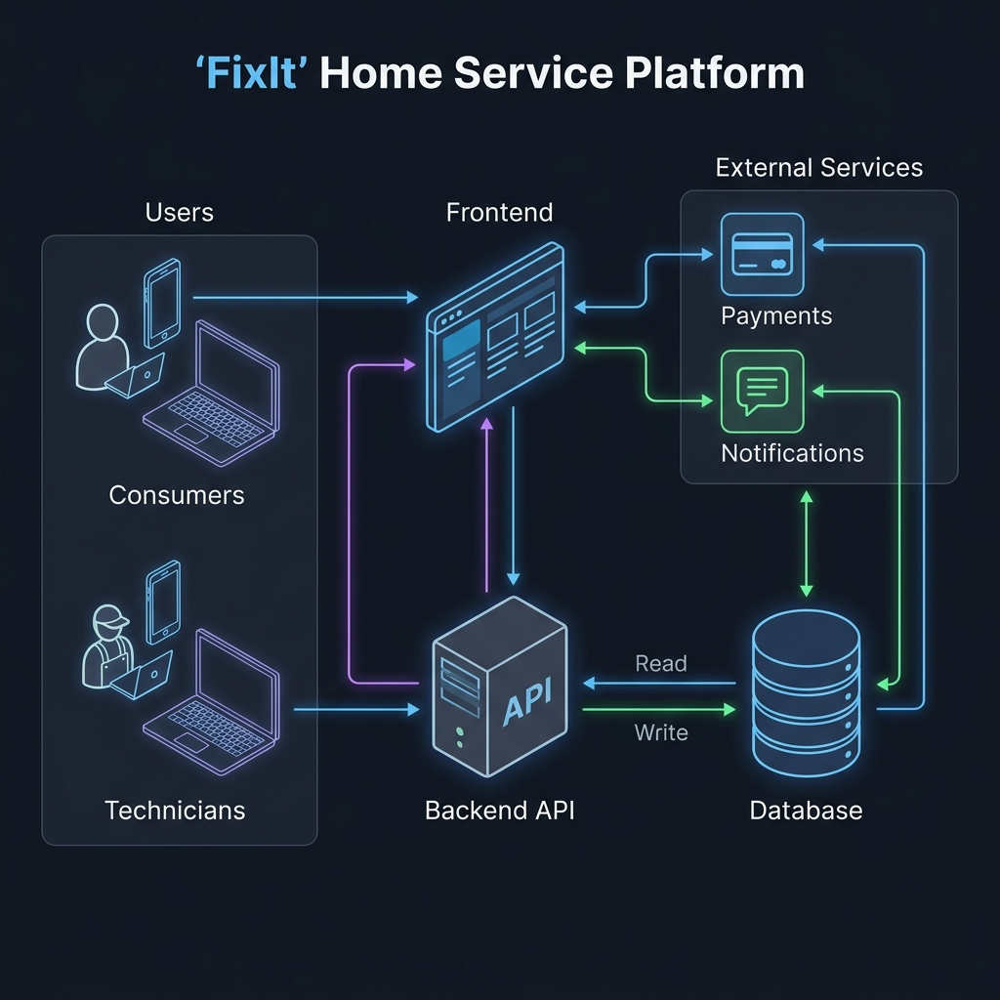

# 🛠️ FixIt - Premium Home Service Platform

**FixIt** is a highly modern, full-stack, on-demand home service platform designed to seamlessly connect consumers with vetted technicians. From AC repairs to plumbing, FixIt allows users to discover services, schedule appointments, post custom jobs, and complete secure payments, all within a beautiful, mobile-responsive application.

## 🌟 Features

### 🧑‍💼 Consumer Portal
- **Service Catalog:** Browse a comprehensive, categorized list of home services.
- **Smart Scheduling:** Pick a date, time, and address for your service.
- **Custom Job Postings:** Post custom jobs with descriptions, photos, and estimated budgets.
- **Secure Checkout:** Fully integrated with Stripe for seamless, secure digital payments.
- **Real-Time Dashboard:** Track the live status of active jobs and view past transaction history.

### 👷 Technician Portal
- **Job Board:** Browse and claim available local custom jobs.
- **Live Agenda:** View today's scheduled jobs, consumer addresses, and service details.
- **Status Updates:** Update job statuses dynamically (En-Route → In Progress → Completed).
- **Earnings Ledger:** Track weekly earnings and view payout histories with sleek chart visualizations.

---

## 🏗️ System Architecture

The application is engineered using a robust, decoupled Monorepo architecture designed for high scalability and separation of concerns.



### 💻 Frontend (Next.js)
The frontend is a server-rendered React application hosted on **Vercel**, optimized for blazing-fast load times and SEO.
- **Framework:** Next.js 16 (App Router)
- **Language:** TypeScript
- **Styling:** Tailwind CSS v4 (Mobile-First, fully responsive)
- **UI Architecture:** Bento Grids, Marquees, Dynamic Sticky Headers

### ⚙️ Backend (NestJS)
The backend is a strictly-typed, scalable REST API hosted securely on **Railway**.
- **Framework:** NestJS
- **Language:** TypeScript
- **Database ORM:** TypeORM
- **Authentication:** JWT (JSON Web Tokens) with refresh token rotation
- **Security:** Helmet, Global Validation Pipes, CORS enabled

### 🗄️ Database (PostgreSQL)
A production-grade relational database managed within Railway's private network.
- **Engine:** PostgreSQL
- **Design:** Complex relational models mapping Users, Services, Bookings, and Financial Transactions.

### 🔌 External Integrations
- **Stripe:** Secure credit card tokenization and intent-based payment processing.
- **Twilio / WhatsApp:** Used for dynamic OTP-based user authentication and status notifications.

---

## 🚀 Getting Started

Follow these steps to run the FixIt monorepo locally.

### Prerequisites
- [Node.js](https://nodejs.org/en/) (v20+)
- [PostgreSQL](https://www.postgresql.org/) (Running locally or via Docker)
- [Stripe Account](https://stripe.com/) (For test API keys)

### 1. Clone the Repository
```bash
git clone https://github.com/abdulhadi-js/Fixit.git
cd Fixit
```

### 2. Backend Setup
```bash
cd backend
npm install
```
Create a `.env` file in the `backend` directory:
```env
# Database
DB_HOST=localhost
DB_PORT=5432
DB_USERNAME=postgres
DB_PASSWORD=yourpassword
DB_NAME=fixit

# Authentication
JWT_SECRET=supersecret
JWT_REFRESH_SECRET=supersecret

# Stripe
STRIPE_SECRET_KEY=sk_test_...
STRIPE_WEBHOOK_SECRET=whsec_...

PORT=3001
```
Start the backend server:
```bash
# Optional: Seed the database with categories and test users
npm run seed

# Run the development server
npm run start:dev
```

### 3. Frontend Setup
```bash
cd ../frontend
npm install
```
Create a `.env.local` file in the `frontend` directory:
```env
NEXT_PUBLIC_API_URL=http://localhost:3001/api/v1
NEXT_PUBLIC_STRIPE_PUBLISHABLE_KEY=pk_test_...
```
Start the frontend server:
```bash
npm run dev
```

Visit `http://localhost:3000` to interact with the application!

---

## 🌐 Deployment Details

This application is fully CI/CD ready and currently deployed across cloud providers:

- **Frontend Environment:** [Vercel](https://vercel.com/)
- **Backend Environment:** [Railway](https://railway.app/)
- **Database Hosting:** [Railway PostgreSQL](https://railway.app/)

To deploy updates, simply push to the `main` branch. Vercel and Railway will automatically detect the changes, build the respective directories (`/frontend` or `/backend`), and deploy them with zero downtime.

---

*Designed and engineered with precision and modern UI/UX principles.*
